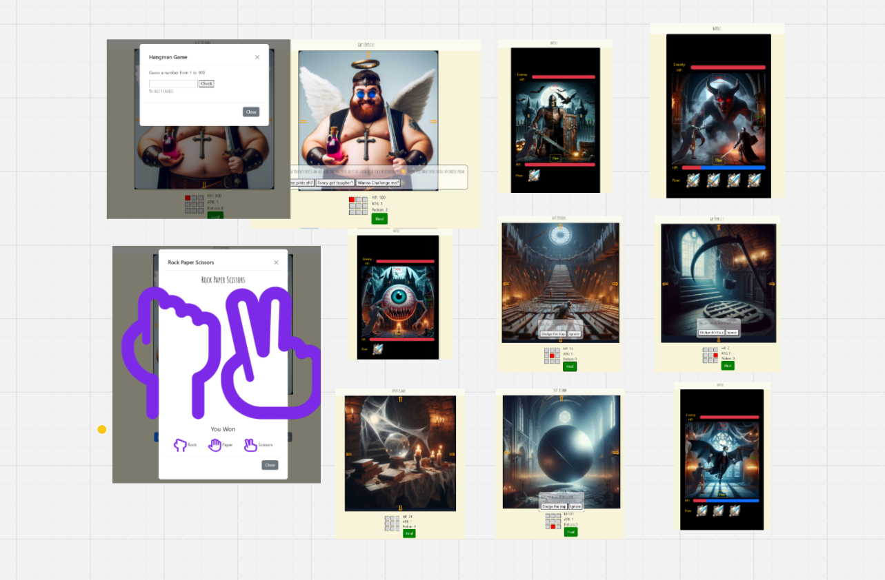
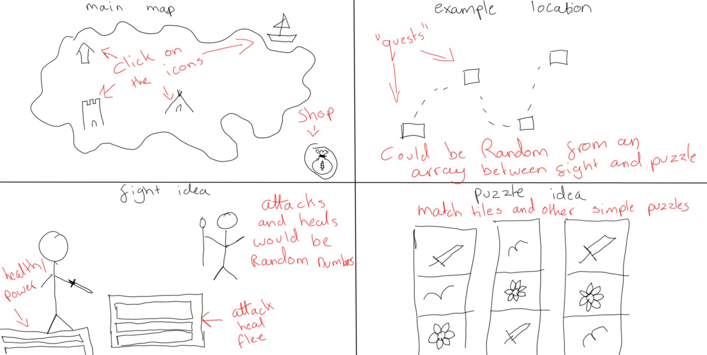
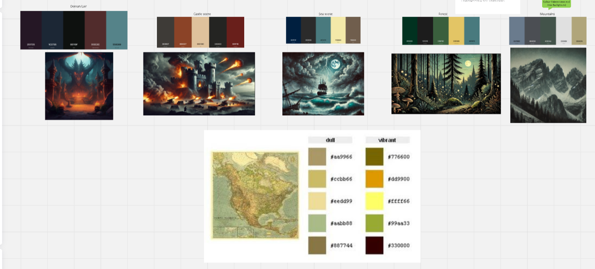
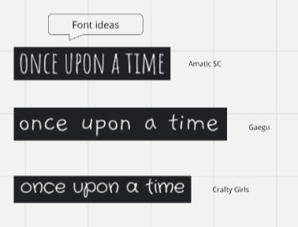
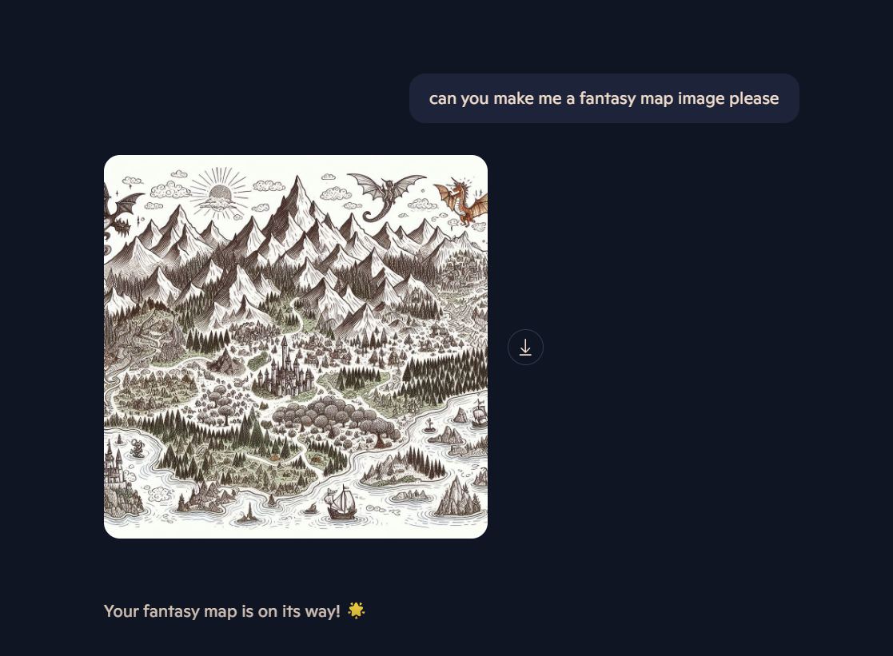
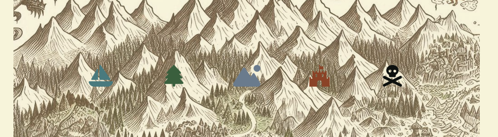
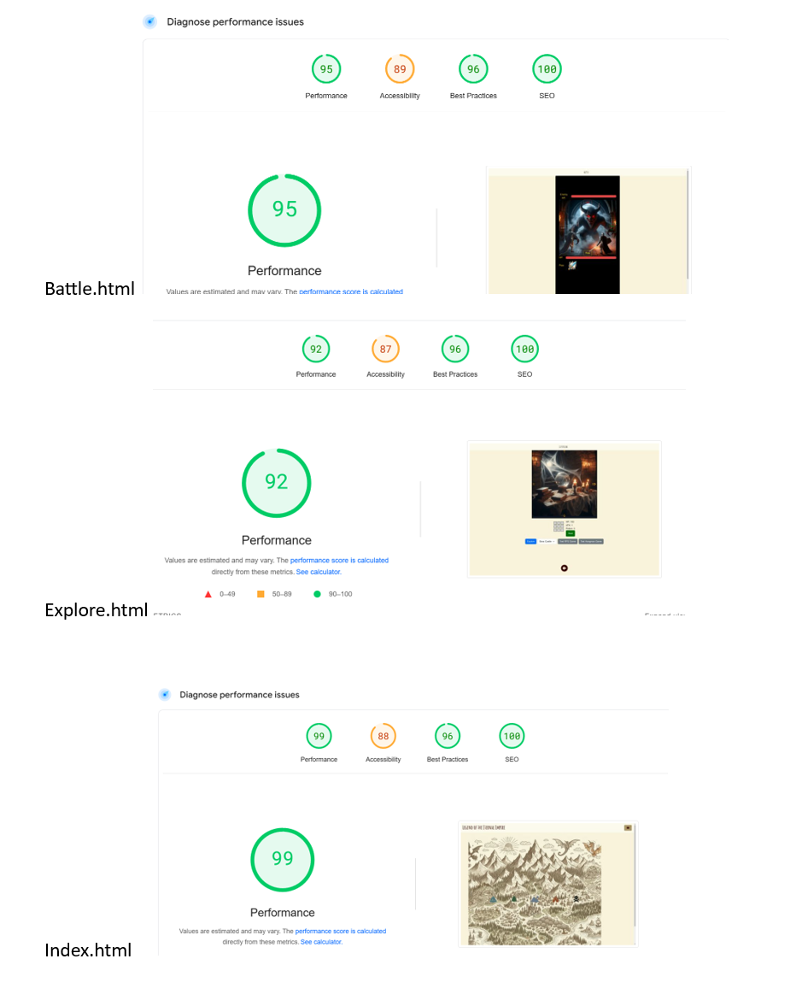
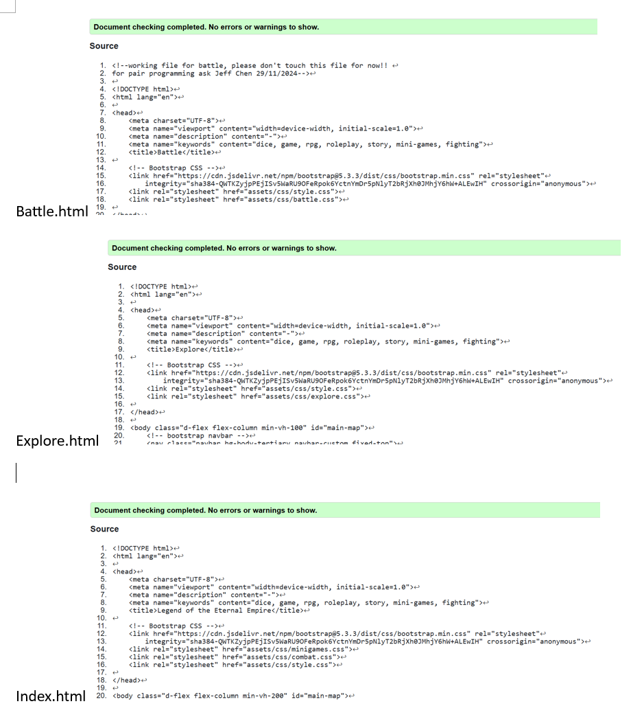
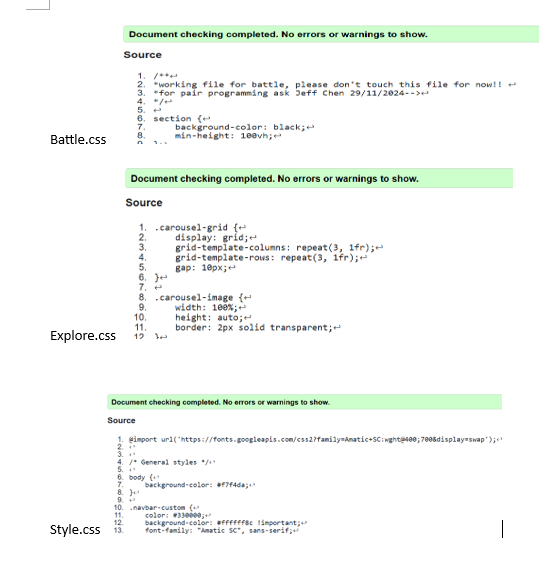

# **Legend of the Eternal Empire**
A web based roleplay game where you adventure to save the lands from being corrupted by the Eternal Empire! Testing your fighting skill, logical knowledge and luck!
 

---

## **Contents**

- [Basics](#Basic)
- [User Design](#user-design)
- [Page Features](#page-features)
- [Responsivity](#responsivity)
- [Future Features](#future-features)
- [Testing](#testing)
    - [Lighthouse Scores](#lighthouse) 
    - [HTML Validation](#html-validation)
    - [CSS Validation](#css-validation)
- [Deployment](#deployment)
- [Credits](#credits)
--- 

## Basics

### Naming
Legend of the Eternal Empire
### User Stories 
- I can engage in boss battles when I click on specific locations, so that I can face greater challenges and earn bigger rewards.
- I can engage in basic combat with enemies,so that I can defeat them and progress further in the game.
- I can view my health, damage, level, and money stats in real-time, so that - I can track my progress and make decisions during the game.
- When enter a location, I will see a 3x3 or 4x4 map so I can freely explore and randomly encounter an event when I click on a direction, so it can be several events or battles in the way until the map is fully explored
So that I experience consequences such as losing money, healing myself, battling with enemies or going back to the map.
- I can click a "Next" button to transition from the blurb page to the interactive map,so that I can begin my journey and explore the world.
- I can see the enemy’s health and damage stats, so that I can strategize my actions during combat.
- I can see a map with multiple clickable locations,so that I can choose where to go and explore the world.
- I can click on a location on the map,so that I can travel to different locations and explore new areas.
- I can participate in a simple mini-game (e.g., Rock-Paper-Scissors) after clicking a location,
so that I can earn rewards when I succeed.
- I can read an introductory blurb with some story information,so that I understand the context of the game and am prepared for the journey ahead.
- I can earn money and rewards from mini-games or defeating enemies,so that I can continue progressing in the game.
- I can gain experience points and level up,
So that I become stronger by increasing my health and damage.

---

## User Design
It’s a single player game, like a story book with plenty fun small puzzle and events leveraging random number, it gives vibes of adventure and fun, which is suitable for a younger age pupil to play but adults certainly can appreciate and enjoy the imaginary artwork by AI.  

### Wireframes

### Colour Scheme and Images

The colour scheme chagnes depending on the location you enter. The main map colour scheme is that of an old vintage map colour to make you feel like you are looking at an old map. Each icon on the map reflects its own colour scheme to set the tone before entering its quest line map. This is to help with the immersion despite it only being a web based RPG. These colour schemes were also paired with their backgorund images to futer enhance this.

### Typography 
When choosing the typography, we wanted to reflect the handmade feeling of Dungeons and Dragons and thus tried to find a hand written "story teller" type font. These were the top choices:

From here, we chose Amatic SC as it was both easy to read but felt as if it were still handwritten.

## Page Features
This RPG is composed by 4 main page features: they are main map, field map, battle map and minigames. main map serves main story, field map provide small areas and events for adventure activities, battle page serves intensive and strategical turn-based battle theme with a variety of mythical creatures, and minigames are for resolving puzzles and take impact on game flows. 

### Main Content
#### Role of AI
The Codepilot has provided majority of images like spooky castle, mythical creatures and event themes. AI also served as a major assistant coder follow developer's thoughts. Majority of time the developer can command AI and expect for solid logic and very few bugs through JavaScript and only in small occasions Human needs to take over to remove or trim down some overgrown code from AI or ask AI to mitigate bugs found. However, when the codebase keeps growing, AI can show some performance bottleneck and could fail to generate results sometimes, but in this scale of project, AI is still proven a robust tool for developer.   

#### Main Map

We asked AI to create the background for most of the pages, starting with the main map for the land.

Using this image we added icons from font awesome that reflected the quest areas. 

#### Minigames

Both minigames were acquired from the internet and then amended for styling purposes.
[Coding Nepal](https://www.codingnepalweb.com/best-javascript-games-for-beginners/)

#### Combat System

The combat system was mainly hand-coded but the code was optimised and cleaned up through chatGPT.

## Responsivity 

## Future Features
- each section will have their on questline
- adding a shop he better equipt the user
- add more maps for explore and expand storyline
- add more minigame puzzles 
- add more events 

### Future Changes
- Icons will be in the correct places
- maps will be centered on the screen

## Testing

Testings are completed on Desktop with 4K resolution and 5.5 inch Mobilephones.   

### LightHouse

### HTML Validation

### CSS Validation

## Deployment
We deployed the site using github and github pages. These are the steps we did:

1. Logged into the GitHub account
2. Went to the repository
3. Click the Settings button near the top of the page
4. Navigated to the Pages button
5. Chose 'main' from the drop-down
6. Selected 'root' from the drop-down folder menu in branch menu
7. Saved adn then waited a short while for the link to be generated.

## Credits
- Amy for the README Layout idea
- Souls like games 